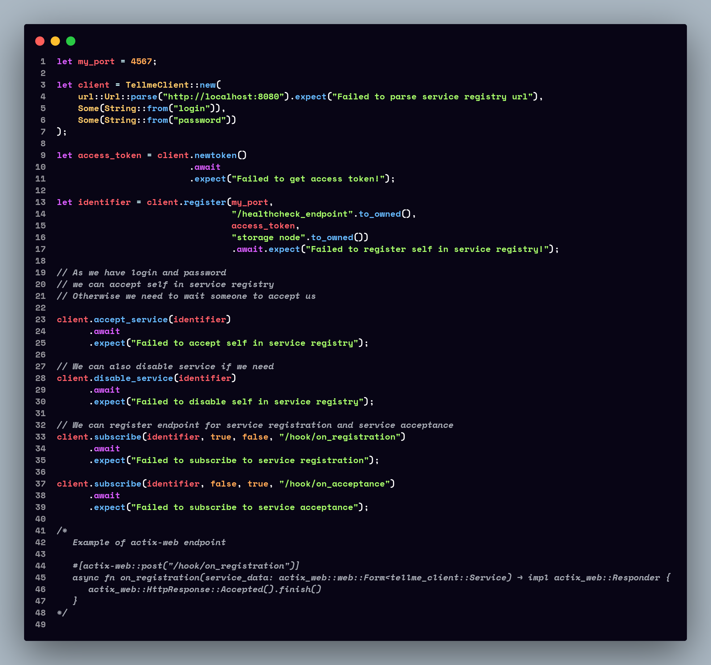

# [tellme-client crate (nightly)](https://crates.io/crates/tellme-client)
[](https://github.com/clowzed/tellme-client/actions/workflows/build.yml) 


Wrapper over tellme service registry API.

[Click here](https://github.com/clowzed/tellme) to learn more about service registry Tellme

## Links
- [Crates.io](https://crates.io/crates/tellme-client)
- [Docs](https://docs.rs/tellme-client/latest/tellme_client)

## Installation
```sh
cargo add tellme-client
```
## Usage


## License
- MIT

## Authors
- [clowzed](https://github.com/clowzed)
